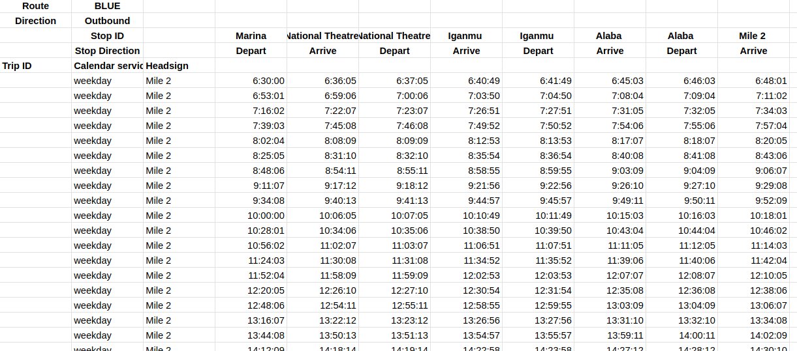
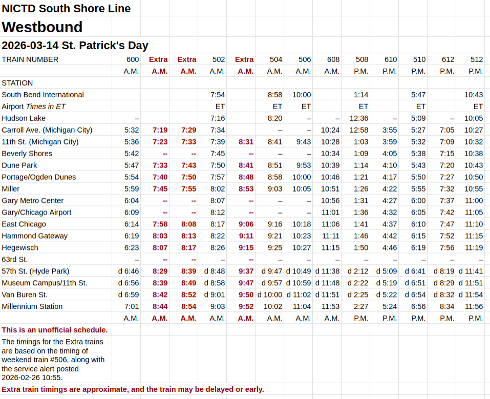
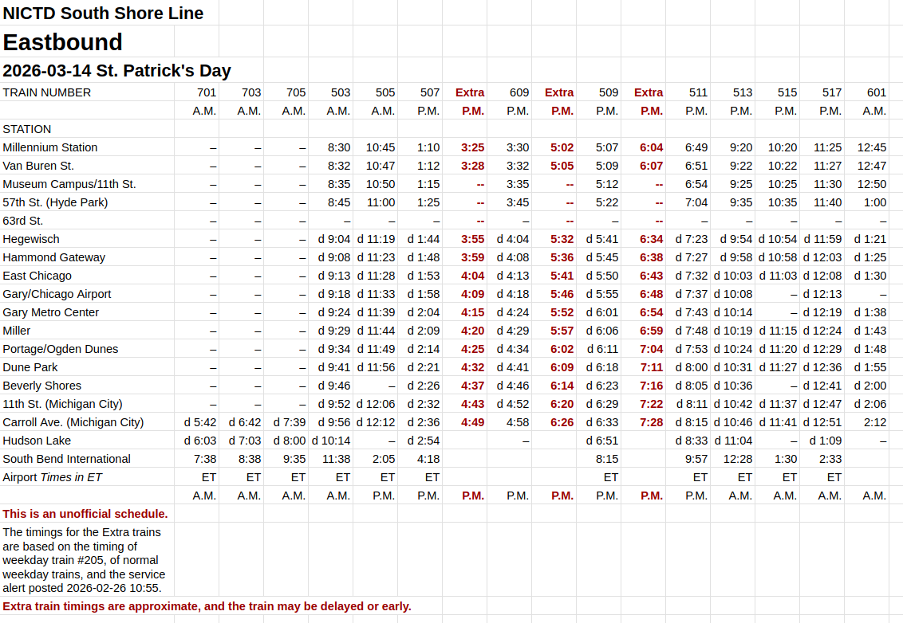

# Unofficial NICTD GTFS feed for 2026-03-14 St. Patrick's Day

[Download GTFS feed (zip)](https://catenarytransit.github.io/nictd-gtfs/gtfs_20260314.zip)

## How the feed is made

* The original GTFS feed was downloaded from the official NICTD GTFS and slightly adjusted
* The timetables are manually slightly modified to get them into a form like this, which is saved in the spreadsheet `input-data/NICTD-2026-03-14-for-GTFS.xlsx`:

* `scripts/run.sh`, which uses `scripts/timetable-to-gtfs.py`, will generate the GTFS timetables

## Source data

[Unofficial timetable](https://docs.google.com/spreadsheets/d/1crHlQwq7kZloTpZ9vYFfCHlgPCTmStL5MjvTWATt8FU/edit?gid=800341299#gid=800341299):

